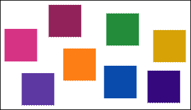
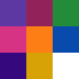
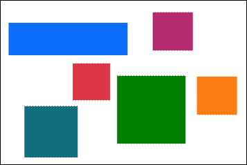

# Introduction

**This project is still under development**

This project is to provide a tool that to tile several images into one file.

From



to



or from



to


# Run

clone this project

```bash
$ yarn install
$ npm run build_ts
$ npm run main src/test/assets/ /tmp/output/
```

# Test

```bash
$ yarn jest
```

# Limitations

* only support png as input
